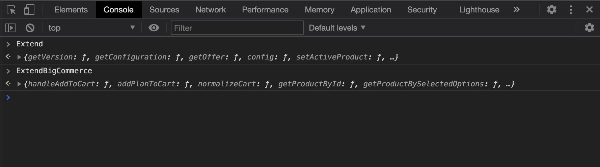
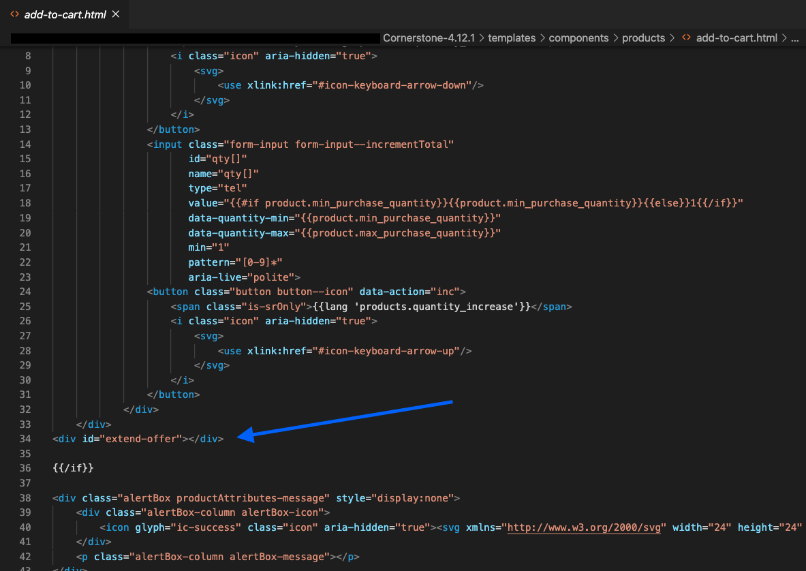
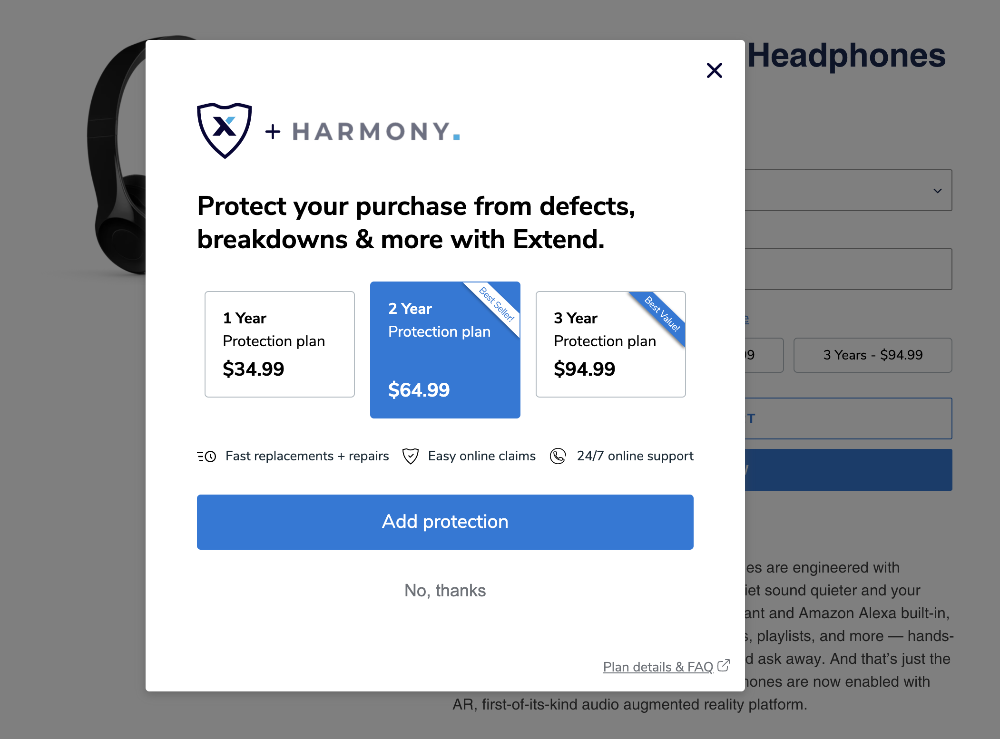
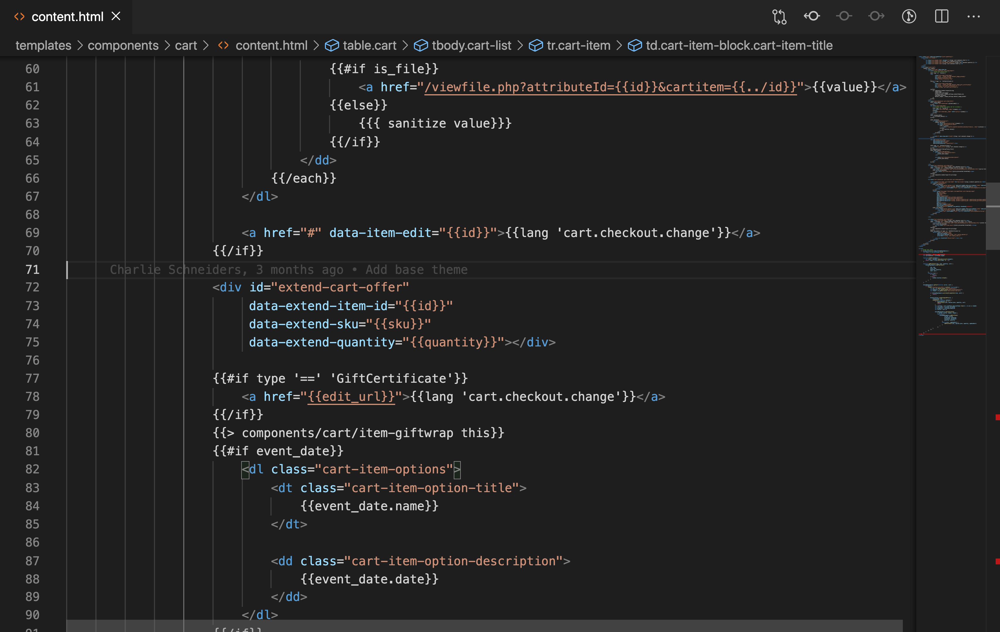
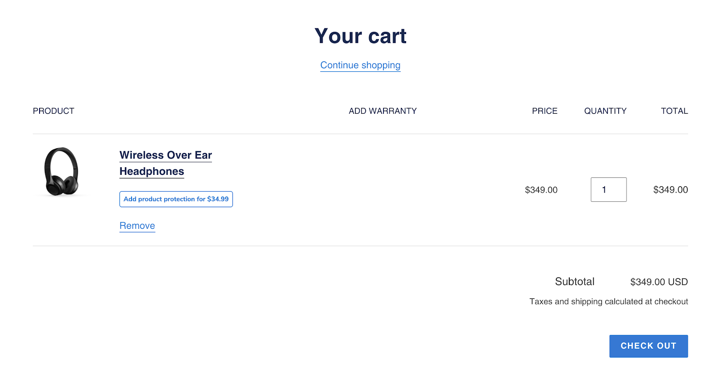

<h1>Overview</h1>

---

Integrating with the Extend SDKs will allow you to display offers and sell extended warranty contracts in your online store. This guide will walk you through how to do the following:

- Install the Extend Client SDK
- Render the extended warranty offers
- Add extended warranties to your cart
- Support quantity matching and cart normalization for extended warranty product SKUs in your cart

<strong>Before you start:</strong> Make sure you have an Extend store created. You can obtain this via the merchant portal (merchants.extend.com) or reach out to your MSM if you have not yet been given an Extend store ID.

<h1>Setup</h1>

---

- Generate a Stencil-CLI access token (if using a stencil theme. See <a href="https://developer.bigcommerce.com/stencil-docs/installing-stencil-cli/live-previewing-a-theme" target="_blank" rel="noopener noreferrer" >here</a> for instructions on how to do this)

- Make a copy of the theme you intend to customize and download it to your

- Setup your local development environment using stencil CLI setup

- Log in to your merchant account with extend at merchants.extend.com and retrieve your Extend store id. If you do not have a merchant account, contact your Merchant Success Manager to have one created for you.

- Generate a BigCommerce API account in your BigCommerce account, and provide these credentials to your Merchant Success Manager or Solution Engineer at Extend. See the section labeled “Obtaining Store API Credentials” <a href="https://developer.bigcommerce.com/api-docs/getting-started/authentication/rest-api-authentication#obtaining-store-api-credentials#obtaining-store-api-credentials" target="_blank" rel="noopener noreferrer">here</a>. You will need to set the following scopes for this API Account:

  - <b>Orders:</b> read-only
  - <b>Order Transactions:</b> read-only
  - <b>Products:</b> read-only
  - <b>Carts:</b> modify
  - <b>Store Information:</b> read-only
  - <b>Sites & Routes:</b> read-only

<h1>Installation</h1>

---

Add the following scripts into your <b>base.html</b> file (if using a stencil theme) right before the closing `</head>` tag and press <b>save</b>. If using a Blueprint theme or custom theme, please ensure the script tags are present in the `<head>` of each page where a shopper can add items to the cart, including the cart page.

```javascript
<script src="https://sdk.helloextend.com/extend-sdk-client/v1/extend-sdk-client.min.js"></script>
<script src="https://sdk.helloextend.com/extend-sdk-client-bigcommerce-addon/v1/extend-sdk-client-bigcommerce-addon.min.js"></script>
<script>Extend.config({ storeId: '<YOUR_EXTEND_STORE_ID>', environment: 'production' })</script>
```

To verify the scripts are running correctly, <b>preview</b> your theme copy, open your browser’s console, type <b>‘Extend’</b> or <b>‘ExtendBigCommerce’</b> and hit enter. Both scripts should appear in the console.



<h2>Add Extend Offer Element</h2>

Add an HTML element where you would like to place the Extend offer buttons. For highest conversion rates, we recommend placing it directly above the add to cart button. In most cases, the button is in the add-to-cart.html file, but if you have done previous work on your product page it may be located somewhere else in your theme.

```html
<div id="extend-offer">This is where the buttons will render</div>
```



<div class="info-container">
<strong>Important Note:</strong> An easy way to find where to place the parent div element is to open the dev tools on a product page and inspect an element above where you would like the cart offers to appear, copy an attribute, and search for it in one of the liquid files mentioned above.

</div>

Verify that the div has been added to the correct spot by temporarily adding some text, saving, and previewing your product page. Once you confirm that the text is showing in the correct spot, make sure to remove it!


<h2>Render Extend Warranty buttons on product page</h2>

Now that the offers element is added, you can use the Extend.buttons.render() function to render the offer buttons on the product page. This function takes in 2 arguments:

- The ID of the `#extend-offer` element you added in the previous step
- An object with a key of referenceId and a value of the selected product `sku`

```javascript
Extend.buttons.render('#extend-offer', {referenceId: <sku>})
```

<h2>Handling Multiple Variants</h2>

In order to prevent a customer from accidentally purchasing the wrong warranty for a product, the warranty offers need to be updated every time a shopper selects a different variant for a product. This is done by passing the variant `sku` of the newly selected product to the `Extend.setActiveProduct` function. Therefore, you will need to determine how your store updates the product page when a different product variant is selected. This is typically done by dispatching a JavaScript event or by manipulating the window location. Add an event listener to the page and invoke `Extend.setActiveProduct()` with the newly selected `sku`.

```javascript
  Extend.setActiveProduct('#extend-offer', <sku>)
```

<div class="info-container">
  <strong>Important Note:</strong> A common way to find the event that fires when a product variant is changed is to look at the eventListeners tied to your product options selector.
</div>

Verify that you are setting the correct variant by adding a console log right before the `Extend.setActiveProduct()` function is called. This ensures you are passing the correct variantId. You will also notice that if you change the variant on the page, the offer buttons will re-render.

<b>Example</b> - Using a Cornerstone-based Stencil Theme

The Cornerstone theme handles variant changes using a method called `productOptionsChanged()` in the <b>product-details.js</b> file. This method exposes the sku of the selected variant. To set the active product include the following line, accessing the sku off of the productAttributesData object:

```javascript
utils.api.productAttributes.optionChange(
  productId,
  $form.serialize(),
  "products/bulk-discount-rates",
  (err, response) => {
    const productAttributesData = response.data || {};
    const productAttributesContent = response.content || {};
    this.updateProductAttributes(productAttributesData);
    this.updateView(productAttributesData, productAttributesContent);
    // ===== Extend SDK ===== //
    Extend.buttons
      .instance("#extend-offer")
      .setActiveProduct(productAttributesData.sku);
    // ===== End Extend SDK ===== //
  }
);
```

<h2>Add the Extend offer modal and add warranties to the cart</h2>

The <b>Modal Offer</b> is a modal rendered before navigating the customer to a new page and adding a product to cart, or as an opportunity on the cart page. In the example below, the offer modal appears after the customer added the product to the cart without selecting one of the offered protection plans.



<b>Example 1</b> - Add an eventListener to the Add to Cart button
Select the Add to Cart button element on the product page using vanillaJS or jQuery and add an eventListener.

```javascript
var addToCartButton = document.querySelector("<button_selector>");
```

```javascript
addToCartButton.addEventListener("click", function (event) {});
```

In order to add the warranty to the cart or launch the offer modal, you need to prevent the default behavior of the Add to Cart button. You can do this by adding an `event.preventDefault()` or `event.stopImmediatePropagation()` inside the eventListener

Use the `ExtendBigCommerce.handleAddToCart()` function inside the add to cart event listener. Make sure to select quantity value from product form and add to `ExtendBigCommerce.handleAddToCart()` function.

```javascript
addToCartButton.addEventListener("click", function (e) {
  e.preventDefault();

  var quantityEl = document.querySelector('[name="quantity"]');
  var quantity = quantityEl && quantityEl.value;

  ExtendBigCommerce.handleAddToCart("#extend-offer", {
    quantity: quantity,
    modal: true,
    done: function () {
      // call function to add your product here
    },
  });
});
```

<b>Example 2</b> - Modify Existing Add to Cart Handler

Alternatively, the following code can be added directly to the existing add to cart handler.

```javascript
if (window.ExtendBigCommerce && window.Extend) {
  popModal();
  const quantityInput = document.querySelector('input[id="qty[]"]');
  const quantity = quantityInput && quantityInput.value;

  window.ExtendBigCommerce.handleAddToCart("#extend-offer", {
    quantity,
    modal: true,
    // done: popModal,
  });
}
```

<h2>Display Cart Offers</h2>

The cart offer is the last chance your shoppers have to add an extended warranty before they checkout. Here you can display an offer button next to each eligible product in the cart that does not already have a protection plan associated with it.



Add an HTML element where you would like to place the Extend cart offer buttons. We recommend placing the element directly below each product in the cart. In the case of Cornerstone Stencil themes, this is in the content.html (and cart-preview.html for mini-cart).

You need to add this button under each product in the cart that does not have a warranty. Find where the cart items are being iterated on in the template. Then set the `quantity` and `sku` of the product to the cart offer div data attributes:

```html
<div
  id="extend-cart-offer"
  data-extend-item-id="<id>"
  data-extend-sku="<sku>"
  data-extend-quantity="<quantity>"
></div>
```

You can verify that the div has been added to the correct spot by temporarily adding some text, saving, and previewing your cart page. Once you confirm that the text is showing in the correct spot, make sure to remove it.

You also need to verify that the `quantity` and `sku` and `cartItemId` are being passed into the cart offer div correctly. In your preview, navigate to your cart and inspect the page. You won’t be able to see the Extend cart offer buttons on the page, but you should see the HTML element.

<h2>Render Cart Offer Buttons</h2>

Find the appropriate javascript file for the shopping cart (cart.js in the case of Cornerstone Stencil themes) and include the following two helper methods:

```javascript
function findAll(element) {
  var slice = Array.prototype.slice;
  var items = document.querySelectorAll(element);
  return items ? slice.call(items, 0) : [];
}

function addPlanToCart(sku, plan, quantity, cart) {
  ExtendBigCommerce.addPlanToCart(
    {
      sku: sku,
      plan: plan,
      quantity: quantity,
      cart: cart,
    },
    function (err) {
      if (err) {
        return;
      } else {
        window.location.reload();
      }
    }
  );
}
```

Call the `findAll` helper method we added in the last step to find all the Extend cart offer divs. Here you need to pass in the ID of the Extend cart offer element `(#extend-cart-offer)`.

As you iterate through each item, pull out the `sku` and the `quantity` from the `#extend-cart-offer` div data attributes.

```javascript
var sku = el.getAttribute("data-extend-sku");
var quantity = el.getAttribute("data-extend-quantity");
```

Use the `warrantyAlreadyInCart()` function to determine if you should show the offer button.

```javascript
if (ExtendBigCommerce.warrantyAlreadyInCart(sku, cart)) {
  return;
}
```

Then render the cart offer buttons using the `Extend.buttons.renderSimpleOffer()` function.

```javascript
Extend.buttons.renderSimpleOffer(el, {
  referenceId: sku,
  onAddToCart: function ({ plan }) {
    ExtendBigCommerce.addPlanToCart(
      {
        sku: sku,
        plan: plan,
        quantity: quantity,
        cart: cart,
      },
      function (err) {
        if (err) {
          return;
        } else {
          window.location.reload();
        }
      }
    );
  },
});
```

Verify the cart offer buttons are rendering correctly by previewing your theme and going to your cart page that has an active and enabled product in it. You should see the Extend cart offer button in the cart, and when you click it, it should launch the offer modal. When a shopper clicks this offer button, the modal described in the previous section will launch, and the shopper will be able to select which warranty plan he or she would like to purchase.



<h2>Setting the Image for Custom Items</h2>

Because the Extend BigCommerce SDK uses Custom Items to create protection plans dynamically, the Extend cart image must be included in your theme, and image markup included in your templates wherever cart items are displayed.

If you are using a Stencil theme built off of Cornerstone, you can do this by taking the following steps:

- Add the image file to your assets/img folder
- Set the image in the config.json file on both the settings and settings.variations properties.
  - `"default_image_extend": "/assets/img/extend_logo.png"`
- Update each template where cart items are displayed to include the following above where the existing item image is rendered:



```html
{{#if type == 'Custom'}}

{{else}}
```



<h2>Cart Normalization</h2>

As part of the checkout process, customers often update product quantities in their cart. The cart normalization feature will automatically adjust the quantity of Extend protection plans as the customer adjusts the quantity of the associated product. If a customer increases or decreases the quantity of products, the quantity for the related warranties in the cart should increase or decrease as well. In addition, if a customer has completely removed a product from the cart, any related warranties should be removed from the cart so the customer does not accidentally purchase a protection plan without a product.

To leverage cart normalization, you’ll need to include the cart normalize function provided by the BigCommerce SDK in your cart.

Place the following snippet in your cart logic so that it runs when your cart initially loads, as well as any time the cart content is refreshed.

```javascript
ExtendBigCommerce.normalizeCart(
  { cart: cart, balance: false },
  function (err, data) {
    if (data && data.updates) {
      return window.location.reload();
    }
  }
);
```

If you are using the stencil Cornerstone theme, this can be done by using this function within the cart.js file. Place the above snippet within the onReady() function, and again in the getContent callback within refreshContent().

`ExtendBigCommerce.normalizeCart` will return a promise that will give you the `data` and `err` object to check if the cart needs to be normalized. If the data object exists and `data.updates` is set to `true`, you will then call your function to refresh the cart page. Typically reloading the page will work for most BigCommerce cart pages.

<h2>Balanced vs unbalanced carts</h2>

Now that you have the normalize function in place, you need to decide if you want a <b>balanced</b> or <b>unbalanced</b> cart.

- <b>Balanced cart:</b> Whenever the quantity of a product with a warranty associated with it is increased, the quantity of the extended warranty sku associated with it will also increase to match.
- <b>Unbalanced cart:</b> Whenever the quantity of a product with a warranty associated with it is increased, the quantity of the extended warranty sku will remain the same, and it is up to the shopper to decide if he or she wants to add warranties to protect those new products.

Balanced and unbalanced carts can be toggled with the `balance: true/false` property.

<h2>Disabling Protection Plan Links within the Cart</h2>

First, navigate to the template that renders the shopping cart contents (in the case of Cornerstone Stencil templates, this will be templates/cart/content.html). Locate where the cart item links are rendered and conditionally remove the href values for warranty cart items.

For example, because the Extend BigCommerce SDK utilizes custom item types for warranty plans, you can target items with type ‘Custom’ by changing this line:



```html
<h2 class="cart-item-name">
  <a class="cart-item-name__label" href="{{url}}">{{name}}</a>
</h2>
```



To this:



```html
{{#if type '==' 'Custom'}}
<h2 class="cart-item-name">
  <a class="cart-item-name__label">{{name}}</a>
</h2>
{{else}}
<h2 class="cart-item-name">
  <a class="cart-item-name__label" href="{{url}}">{{name}}</a>
</h2>
{{/if}}
```



If you are using Custom items for other functionality besides Extend, you can disable links on warranty items by targeting cart items with skus that contain the string ‘;xtd;’

<h1>ExtendBigCommerce API Reference</h1>

---

<h2>BigCommerce.addCartItem(opts: CartAddOpts, callback?: function)</h2>

This function adds a product from your catalog to the cart.

<h3>Attributes</h3>

| Attribute                     | Data type | Description                                                                                                       |
| :---------------------------- | :-------- | :---------------------------------------------------------------------------------------------------------------- |
| opts <br/> _**required**_     | object    | CartAddOpts                                                                                                       |
| callback <br/> _**optional**_ | function  | Callback function that will have parameters (err, cart) that will be executed after the item is added to the cart |

<h3>CartAddOpts Object</h3>

| Attribute                             | Data type        | Description                                               |
| :------------------------------------ | :--------------- | :-------------------------------------------------------- |
| cartId <br/> _**required**_           | string           | The BigCommerce UUID for the current cart                 |
| productId <br/> _**required**_        | number           | Product associated with the warranty plan                 |
| variantId <br/> _**required**_        | number           | Variant associated with the warranty plan                 |
| quantity <br/> _**required**_         | number           | The product quantity to add                               |
| optionSelections <br/> _**optional**_ | ItemOption array | Specific options selected by the shopper for this product |

<h3 class="interface">Interface</h3>

```typescript
interface ItemOption {
  optionId: string;
  optionValue: string;
}
```

<h2>BigCommerce.addPlanToCart(opts: AddToCartOpts, callback?: function)</h2>

This function adds an Extend warranty plan to the cart as a custom item.

<div class="info-container">
<b>Important Note:</b> If you are looking to add a product and its associated warranty to the cart, please see <b>#handleAddToCart</b> instead.
</div>

<h3>Attributes</h3>

| Attribute                     | Data type | Description                                                                        |
| :---------------------------- | :-------- | :--------------------------------------------------------------------------------- |
| opts <br/> _**required**_     | object    | AddToCartOpts                                                                      |
| callback <br/> _**optional**_ | function  | Callback function that will be executed after the Extend plan is added to the cart |

<h3>AddToCartOpts Object</h3>

| Attribute                     | Data type | Description                                                |
| :---------------------------- | :-------- | :--------------------------------------------------------- |
| sku <br/> _**required**_      | string    | The sku for the product associated with the warranty plan  |
| plan <br/> _**required**_     | string    | The warranty plan to be added to the cart                  |
| cart <br/> _**optional**_     | object    | BigCommerce cart object for the current cart               |
| quantity <br/> _**optional**_ | number    | The number of plans to add (defaults to 1 if not provided) |

<h2>BigCommerce.deleteCartItem(opts: CartRemoveOpts, callback?: function)</h2>

This function provides a convenient way to remove an item from the cart. In some cases it may be necessary to make an explicit call to remove an item from the cart in order to sort cart items properly (i.e. to ensure that a warranty item is directly beneath the corresponding product).

<h3>Attributes</h3>

| Attribute                     | Data type | Description                                                                                                           |
| :---------------------------- | :-------- | :-------------------------------------------------------------------------------------------------------------------- |
| opts <br/> _**required**_     | object    | CartRemoveOpts                                                                                                        |
| callback <br/> _**optional**_ | function  | Callback function that will have parameters (err, cart) that will be executed after the item is removed from the cart |

<h3>CartRemoveOpts Object</h3>

| Attribute                   | Data type | Description                                               |
| :-------------------------- | :-------- | :-------------------------------------------------------- |
| cartId <br/> _**required**_ | string    | The sku for the product associated with the warranty plan |
| itemId <br/> _**required**_ | string    | The item you wish to remove from the cart                 |

<h2>BigCommerce.getCart(callback?: CartCallBack)</h2>

This function provides a convenient way to fetch the BigCommerce cart in the event that the current cart object is not available.

<h3>Attributes</h3>

| Attribute                     | Data type | Description                                                                                             |
| :---------------------------- | :-------- | :------------------------------------------------------------------------------------------------------ |
| callback <br/> _**optional**_ | function  | Callback function that will have parameters (err, cart) that will be executed after the cart is fetched |

<h2>BigCommerce.getProductById(opts: GetProductByIdOpts)</h2>

This function provides a convenient way to fetch product details by productId in the event that required product information (e.g. sku) is not accessible.

| Attribute                 | Data type | Description        |
| :------------------------ | :-------- | :----------------- |
| opts <br/> _**required**_ | function  | GetProductByIdOpts |

<h3>GetProductByIdOpts Object</h3>

| Attribute                               | Data type | Description                                                                                      |
| :-------------------------------------- | :-------- | :----------------------------------------------------------------------------------------------- |
| productId <br/> _**required**_          | string    | The productId of the product being fetched                                                       |
| storefrontApiToken <br/> _**required**_ | string    | The storefront API token required to make GraphQL calls                                          |
| done <br/> _**required**_               | function  | Callback function that will have parameters (err, data) where data is the graphql product object |

<h2>BigCommerce.getProductBySelectedOptions(opts: GetProductBySelectedOptionsOpts)</h2>

This function provides a convenient way to get product information when the only available data is the specific product attributes selected by the user.

<h3>Attributes</h3>

| Attribute                 | Data type | Description                     |
| :------------------------ | :-------- | :------------------------------ |
| opts <br/> _**optional**_ | object    | GetProductBySelectedOptionsOpts |

<h3>GetProductBySelectedOptionsOpts Object</h3>

| Attribute                               | Data type | Description                                                                                                             |
| :-------------------------------------- | :-------- | :---------------------------------------------------------------------------------------------------------------------- |
| productId <br/> _**required**_          | string    | The productId of the product being fetched                                                                              |
| productOptions <br/> _**required**_     | string    | ProductOptions array interface defines the structure for product options if they are included in an add to cart request |
| storefrontApiToken <br/> _**required**_ | string    | The storefront API token required to make GraphQL calls                                                                 |
| done <br/> _**required**_               | function  | Callback function that will have parameters (err, data) where data is the graphql product options object                |

<h3 class="interface">Interface</h3>

```typescript
interface ProductOption {
  optionEntityId: number;
  valueEntityId: number;
}
```

<h2>BigCommerce.handleAddToCart(element: ElementRef, opts: HandleAddToCartOpts)</h2>

<h3>Attributes</h3>

| Attribute                    | Data type | Description                                       |
| :--------------------------- | :-------- | :------------------------------------------------ |
| element <br/> _**required**_ | object    | The html element used to add products to the cart |
| opts <br/> _**optional**_    | object    | HandleAddToCartOpts                               |

<h3>HandleAddToCartOpts Object</h3>

| Attribute                     | Data type | Description                                                                                                                           |
| :---------------------------- | :-------- | :------------------------------------------------------------------------------------------------------------------------------------ |
| modal <br/> _**optional**_    | boolean   | If a shopper attempts to add a product to cart without selecting a warranty plan, setting modal to true will render the Offers modal. |
| quantity <br/> _**optional**_ | number    | The number of warranty plans to be added to cart. This should match the number of products added to cart.                             |
| cart <br/> _**optional**_     | object    | BigCommerce cart object for the current cart                                                                                          |
| done <br/> _**required**_     | function  | Callback function that will have parameters (err, data)                                                                               |

<h2>BigCommerce.normalizeCart(optsOrCb: NormalizeCartOptions | Callback)</h2>

This function accepts and updates the BigCommerce cart object to ensure that the line item quantity of a warranty is not greater than the line item quantity of its associated product and returns an object containing the updated cart and cart updates. Therefore, this function should be executed every time the cart is updated in order to ensure a user cannot buy a warranty for a product not in the cart. While optional, a callback should almost always be passed as a second argument. This callback will be executed after the cart normalizes and should therefore be used to update the quantity input selectors on the page with their updated values, typically via a hard refresh.

<b>Use case:</b> Cart normalization

```javascript
ExtendBigCommerce.normalizeCart(
  { cart: cart, balance: false },
  function (err, data) {
    if (data && data.updates) {
      hardRefresh();
    }
  }
);
```

<h3>Attributes</h3>

| Attribute                                 | Data type | Description                                                                                                                                                                         |
| :---------------------------------------- | :-------- | :---------------------------------------------------------------------------------------------------------------------------------------------------------------------------------- |
| normalizeCartOptions <br/> _**required**_ | object    | <a href="https://helloextend.github.io/client-integrations/extend-shopify-sdk#api-normalize-cart-options-object" target="_blank" rel="noopener noreferrer">NormalizeCartOptions</a> |
| callback <br/> _**optional**_             | function  | Callback function that will be executed after the `normalizeCart` function is invoked (Typically refreshes the cart)                                                                |

<h3>NormalizeCartOptions Object</h3>

| Attribute                    | Data type | Description                                                                        |
| :--------------------------- | :-------- | :--------------------------------------------------------------------------------- |
| cart <br/> _**optional**_    | object    | BigCommerce cart object to be normalized                                           |
| balance <br/> _**required**_ | boolean   | When set to `true` warranty quantity will be equal the associated product quantity |

<h3>Interface</h3>

```typescript
interface NormalizeCartOptions {
  balance?: boolean;
  cart?: Cart;
}
```

<h3>Normalize cart response object</h3>

| Attribute     | Data type      | Description                                                     |
| :------------ | :------------- | :-------------------------------------------------------------- |
| cart <br/>    | object         | Normalized Cart Object                                          |
| updates <br/> | object or null | Object containing each updated sku and their updated quantities |

<h2>BigCommerce.warrantyAlreadyInCart(sku: string, cart: Cart)</h2>

This function accepts a BigCommerce `sku` and the BigCommerce. The function iterates through the BigCommerce cart items and returns a boolean indicating if there is already a warranty in the cart for that product `sku`. This function is almost always used on the cart page to determine whether or not to render a <a href="https://helloextend.github.io/client-integrations/extend-shopify-sdk#render-cart-offer-buttons" target="_blank" rel="noopener noreferrer">cart offer button</a> for a line item in the cart.

| Attribute                 | Data type | Description                                                       |
| :------------------------ | :-------- | :---------------------------------------------------------------- |
| sku <br/> _**required**_  | string    | The BigCommerce `sku` of the product to be checked for a warranty |
| cart <br/> _**required**_ | object    | BigCommerce cart object for the current cart                      |
