<h1>Overview</h1>

---

Integrating with the Extend SDK will allow you display offers and sell extended warranty contracts from your online store. This guide will walk you through how to do the following:

- Install the Extend Client SDK
- Render the extended warranty offers
- Add extended warranties to your cart
- Support quantity matching and cart normalization for extended warranty product SKUs in your cart

**Before you start:** Make sure you have installed the Shopify Extend App. Visit [merchants.extend.com](https://merchants.extend.com/login) and login with Shopify account'.

<h2>Setting Up</h2>

Before you start integrating with the Extend SDK you'll need to do the following

- Create a copy of your current theme to work out of
- Get your API credentials
- Initialize the Extend SDK

<h2>Create a Copy of Your Current Theme</h2>

From the Shopify admin, go to **Online Store** → **Themes** → **Actions** → **Duplicate**

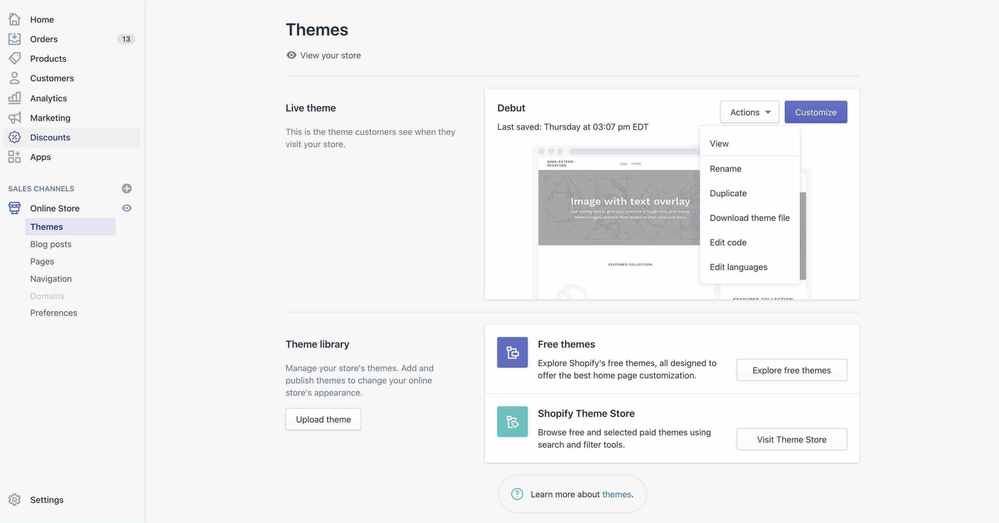

<div class="info-container">
<strong>Important note:</strong> Once you start the integration, you should treat this copied theme as your master copy. It is important to not make any changes to your live theme or publish a new theme, as those changes might interfere with the Extend integration.
</div>

<h2>Get your Store Id</h2>

In order to configure the SDK to your store, you will need your Store Id.

Go to [merchants.extend.com](https://merchants.extend.com/login)→ **Settings** → **Production/Sandbox credentials**

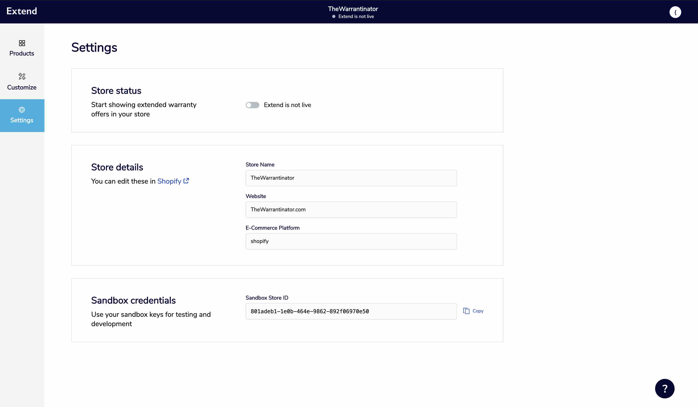

<h2>Installation</h2>
  
Add the following scripts into your **theme.liquid** file right before the closing `</head>` tag and press **save**. 
  
```html  
<script src="https://sdk.helloextend.com/extend-sdk-client/v1/extend-sdk-client.min.js"></script>  
<script src="https://sdk.helloextend.com/extend-sdk-client-shopify-addon/v1/extend-sdk-client-shopify-addon.min.js"></script>  
<script>Extend.config({ storeId: '<YOUR_EXTEND_STORE_ID>', environment: 'production' : 'demo' })</script>
```

To verify the scripts are running correctly, **preview** your theme copy, open your browser's console, and type **Extend** or **ExtendShopify** and hit enter. Both scripts should appear in the console.

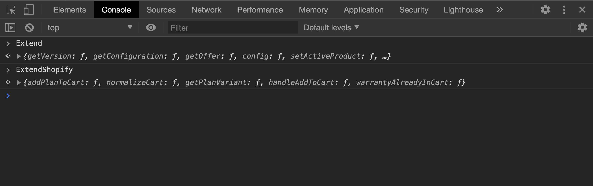

<h1>Displaying Product Page Offers</h1>
<div class="key-line"></div>

The **Product Offer** is used to display one or more protection plan offers directly on the product page and is the shoppers first opportunity to add a warranty plan to the cart. Typically this will show 1-, 2-, and 3-year options for the same plan.


<h2>Add the Extend Offer Element</h2>

Add an HTML element where you would like to place the Extend offer buttons. For highest conversion rates, we recommend placing it directly above the add to cart button. In most cases, the button is in the **product-template.liquid**, **product.liquid**, or **product.form.liquid** file, but if you have done previous work on your product page the it may be located somewhere else in your theme.

```html
<div id="extend-offer">This is where the buttons will render</div>
```

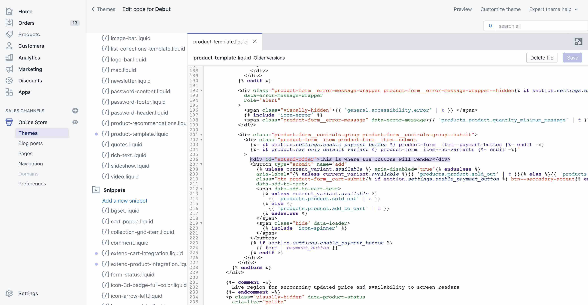

<div class="info-container">
<strong>Pro Tip</strong>: An easy way to find where to place the parent div element is to open the dev tools on a product page and inspect an element above where you would like the cart offers to appear, copy an attribute, and search for it in one of the liquid files mentioned above.
</div>

Verify that the div has been added to the correct spot by temporarily adding some text, saving, and previewing your product page. Once you confirm that the text is showing in the correct spot, make sure to remove it!

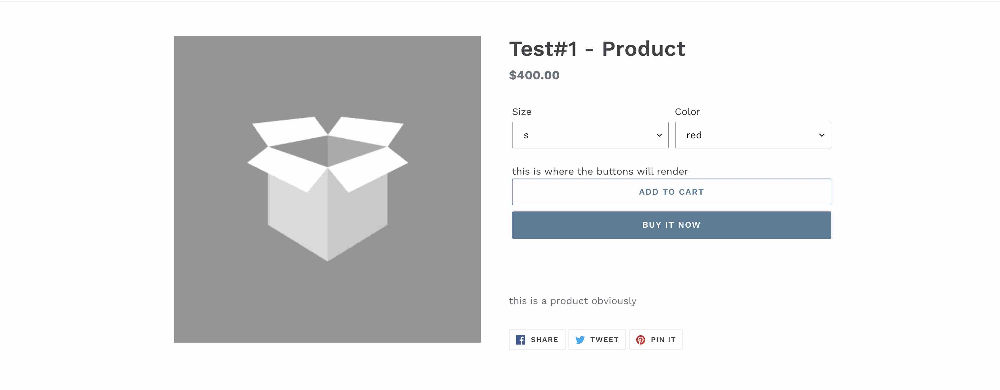

<h2>Create custom product integration snippet</h2>

Inside your shopify theme code editor create a new snippet called **extend-product-integration**. This is where you will call the Extend APIs to display offers on the product page and add the warranties to the cart.

**Themes** → **Snippets** → **Add a new snippet**

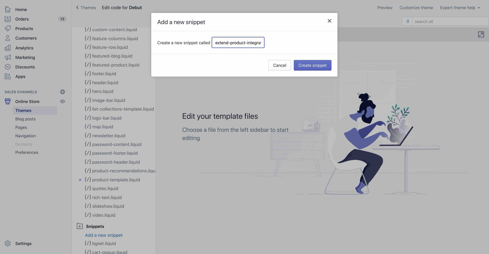

To ensure this snippet only runs when the Extend SDK is properly initialized, add the following code:

```html
<script>
  if (window.Extend && window.ExtendShopify) {
    // Integration code will go here
  }
</script>
```

Render the snippet on the same page you added the Extend product offer div by adding the following code to that page.



```javascript

```



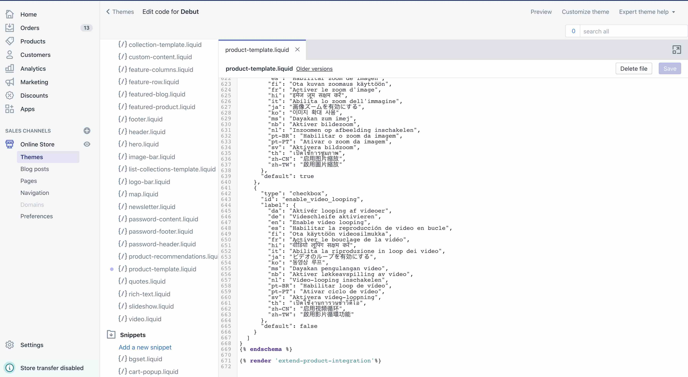

<h2>Render Extend warranty buttons on product page</h2>

Now that the snippet is added, you can use the Extend.buttons.render() function to render the offer buttons on the product page. This function takes in 2 arguments:

- The id of the `#extend-offer` element you added in the previous step
- An object with a key of referenceId and a value of the selected product `variantId`

```javascript
  Extend.buttons.render('#extend-offer', {referenceId: {{ product.selected_or_first_available_variant.id }}})
```

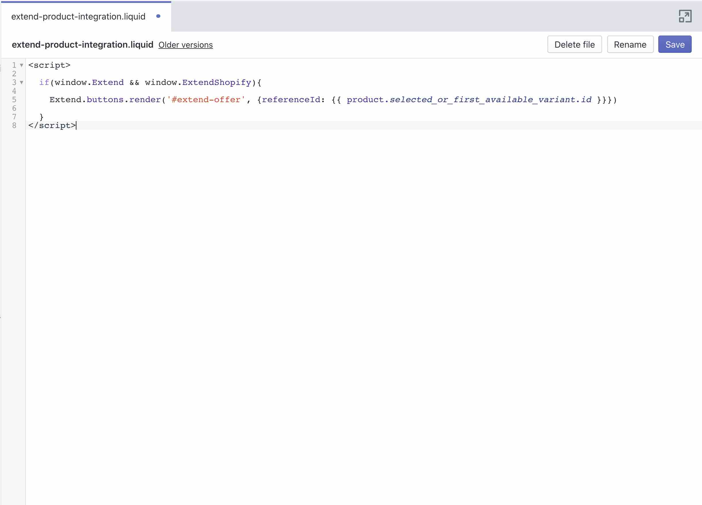

<div class="info-container">
<strong>Important Note</strong>: <strong>{{ product.selected_or_first_available_variant.id }}</strong> allows you to get the first selected `variantId` when the page loads in your Shopify store, however, this variable <strong>does not update</strong> when a user changes the variant. The next section covers how to handle that scenario.
</div>
Verify that the warranty buttons are rendering by previewing your theme and viewing a product that is **active** and **enabled**. If you don’t know a product that fits this criteria, you can go to the merchant portal [merchants.extend.com](https://merchants.extend.com/login) and find one.

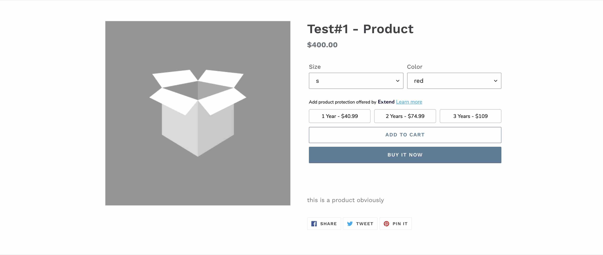

<h2>Troubleshooting Tips:</h2>

If you are having trouble seeing the warranty buttons, please ensure that:

- You are viewing a product that is **matched** and **active**
- Your store is **live** (can verify in the merchant portal at the top of your screen)
- You are rendering the snippet on page that contains offer div

<h2>Handling multiple variants</h2>

Whenever a shopper selects a different variant for a product, you need to pass the `variantId` of the newly selected product to the SDK. This prevents a customer from accidentally purchasing the wrong warranty for a product. Determine how the page is updated when the variant is changed for a product. This is typically via a JavaScript event being dispatched, or by manipulating the window location. Then call the `Extend.setActiveProduct()` function to set the active variant.

```javascript
  Extend.setActiveProduct('#extend-offer', <VariantId>)
```

<div class="info-container">
<strong>Pro Tip</strong>: A common way to find the event that fires when a product variant is changed is to look at the event listeners tied to your product options selector.
</div>

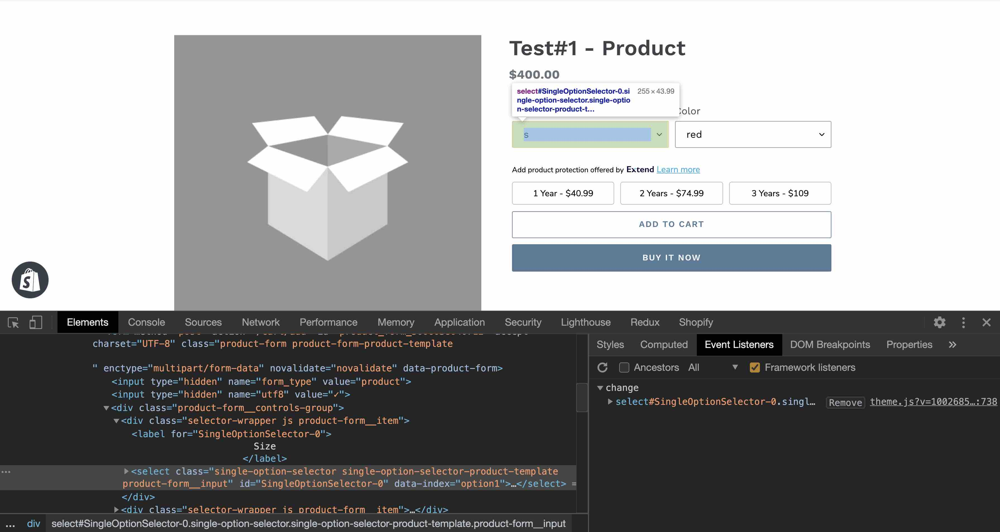 **@nima lets make this a white background**

Verify that you are setting the correct variant by adding a console log right before the Extend.SetActiveProduct() function is called. This ensures you are passing the correct `variantId`. You will also notice that if you change the variant on the page, the offer buttons will re-render.

<h2>Examples</h2>

VariantIds are not accessible in the same way across all Shopify themes. Below are two of the most common examples we have seen.

**Example 1**: `variantId` in url

In the example below, the `variantId` is available in the url when the product variant changes. To set the active variant, you need to grab the `variantId` from the url and call `javascript Extend.setActiveProduct()`.

```javascript
var productForm = document.querySelector(".product-form");

productForm.addEventListener("change", function () {
  var urlParams = new URLSearchParams(window.location.search);
  var variantId = urlParams.get("variant");
  if (variantId) {
    Extend.setActiveProduct("#extend-offer", variantId);
  }
});
```

<div class="info-container">
<strong>Important note</strong>: sometimes the variantId in the url is only available when the variant changes (and not when you load the page for the first time). You can set the variantId with <strong>{{ product.selected_or_first_available_variant.id }}</strong> to cover this case.
</div>

**Example 2**: variantId in theme.js file

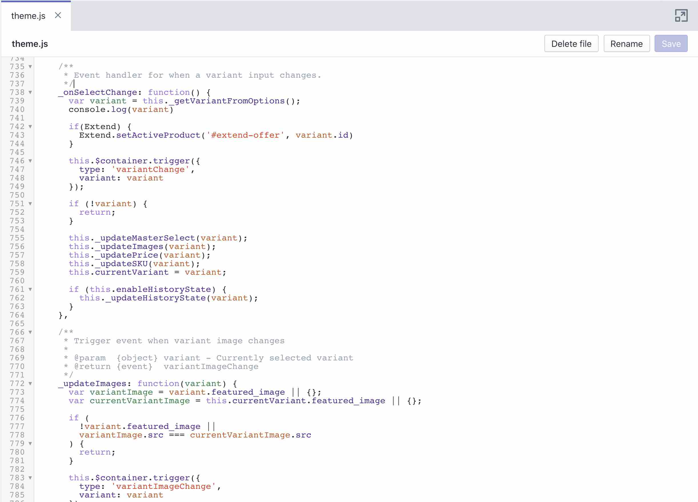

<div class="info-container">
<strong>Important Note</strong>: The variant change function may be in your Assets folder or somewhere else in your Shopify theme.
</div>

<h1>Offer Modal and Adding Warranties to the Cart</h1>
<div class="key-line"></div>

The **Modal Offer** can be used as an interstitial modal before transitioning the customer to a new page after adding a product to cart, or as an opportunity on the cart page. In the example below, the offer modal appears after the customer added the product to the cart without selecting one of the offered protection plans.

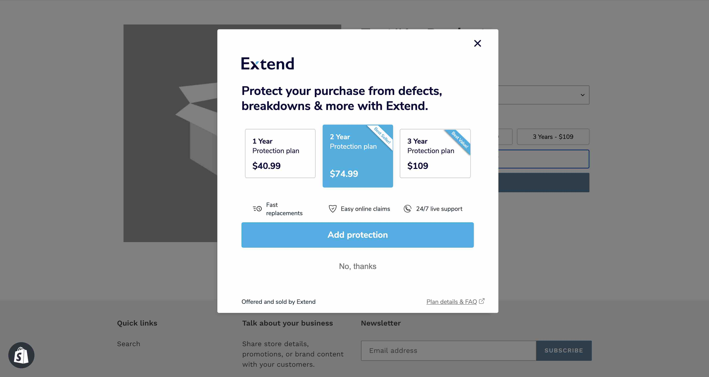

<h2>Add event listener to add to cart button</h2>

Select the add to cart button element on the product page using vanillaJS or jQuery and add an event listener.

```javascript
var addToCartButton = document.querySelector("button[name='add']");
```

```javascript
addToCartButton.addEventListener("click", function (e) {});
```

In order to add the warranty to the cart or launch the offer modal, you need to prevent the default behavior of the add to cart button. You can do this by adding an `event.preventDefault()` or `event.stopImmediatePropagation()` inside the eventListener.

```javascript
e.preventDefault();

or;

e.stopImmediatePropagation();
```

Inside the add to cart event listener, add `ExtendShopify.handleAddToCart()` Function. Make sure to select quantity value from product form and add to `ExtendShopify.handleAddToCart()` Function.

```javascript
addToCartButton.addEventListener("click", function (e) {
  e.preventDefault();

  var quantityEl = document.querySelector('[name="quantity"]');
  var quantity = quantityEl && quantityEl.value;

  ExtendShopify.handleAddToCart("#extend-offer", {
    quantity: quantity,
    modal: true,
    done: function () {
      // call function to add your product here
    },
  });
});
```

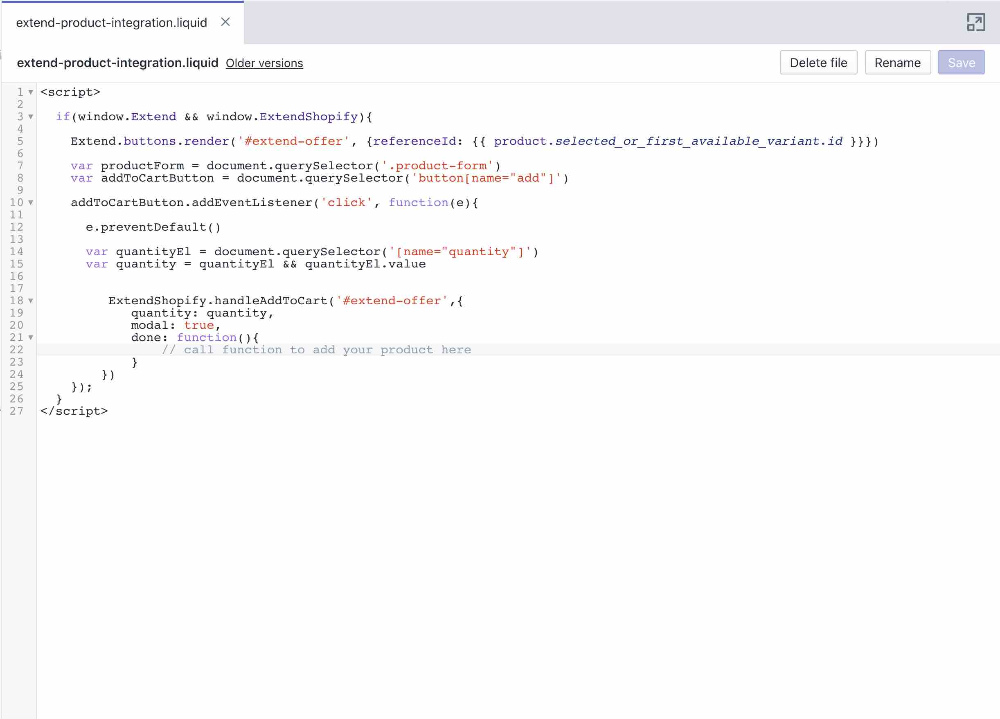

To launch the offer modal if a warranty is not selected, set `modal: true`. If you do not want to launch the offer modal, set it `modal: false`.

<h2>Resume Add to Cart function</h2>

Once the warranty has been added to the cart or the shopper has decided to not add a warranty (from the offer modal), you need to resume the add to cart function so that the product gets added to the cart. Inside the done function, trigger your theme’s product form submit function. This can be done in a number of ways, so it is up to you to determine the best solution for your theme. Below are some examples:

**Standard add to cart flow (i.e form submission):**

```javascript
// select the form where the add to cart button is in.
var productForm = document.querySelector(".product-form");

// call the submit method on the form element to trigger the form submission
productForm.submit();
```

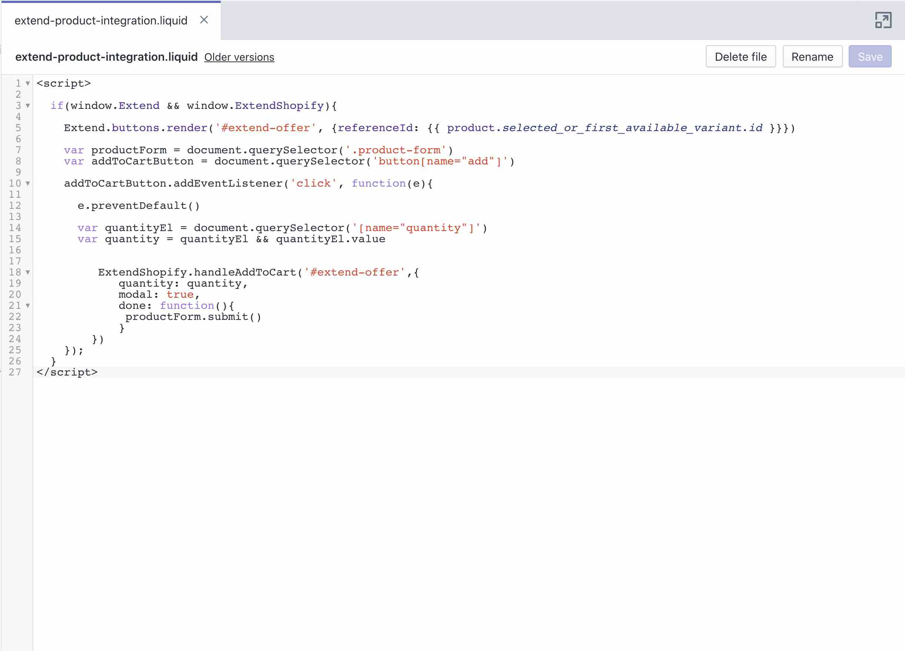

**Ajax-carts:**

- Markdown **@nima I think we are missing this sectino**

<h1>Cart Offers</h1>
<div class="key-line"></div>

The cart offer is the last chance your shoppers have to add an extended warranty before they checkout. Here you can display an offer button next to each eligible product in the cart that does not already have a protection plan associated with it.

**Cart Offer Example**:

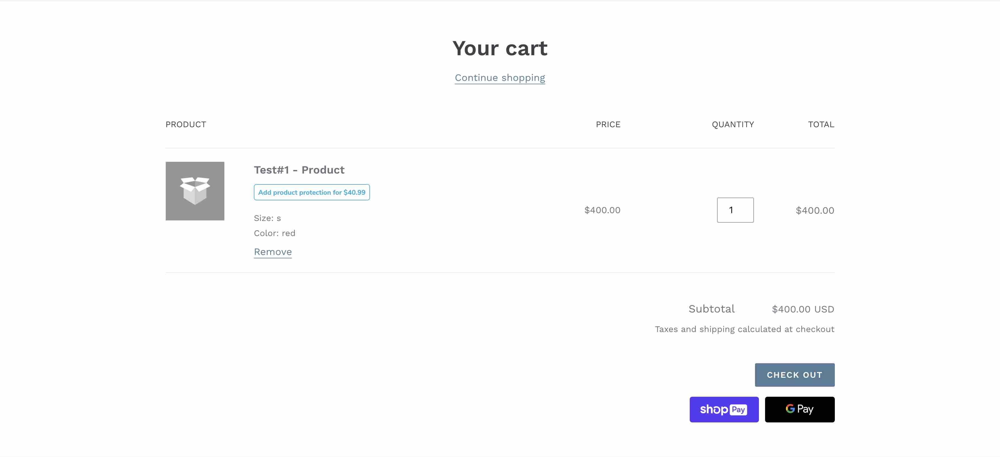

<h2>Add the Extend Cart Offer Element</h2>

Add an HTML element where you would like to place the Extend cart offer buttons. We recommend placing it directly below each product in the cart. In most cases, that is in the **cart.liquid** or the **cart-template.liquid** file.

You need to add this button under each product in the cart that doesn’t have a warranty. Find where the cart items are being iterated on in the template. Then set the quantity and variant_id of the product to the cart offer div data attributes:

```html
<div
  id="cart-extend-offer"
  data-extend-variant="{{ item.variant.id }}"
  data-extend-quantity="{{ item.quantity }}"
></div>
```

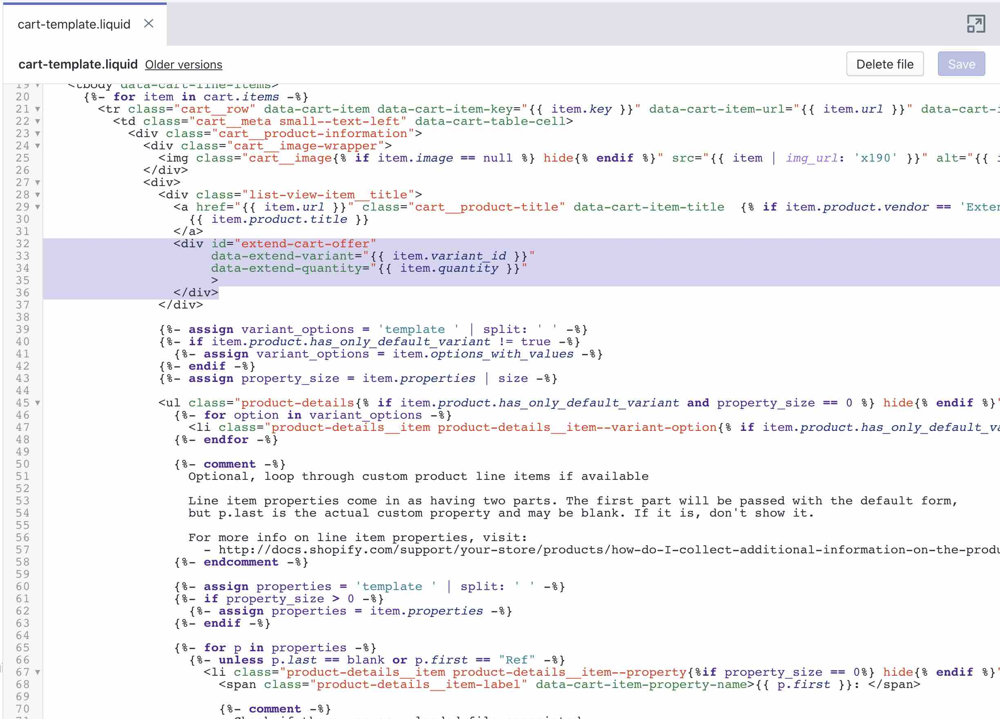

Verify that the div has been added to the correct spot by temporarily adding some text, saving, and previewing your cart page. Once you confirm that the text is showing in the correct spot, make sure to remove it!

You also need to verify that the `quantity` and `variantId` are being passed into the cart offer div correctly. In your preview, navigate to your cart and inspect the page. You won’t be able to see the Extend cart offer buttons on the page, but you should see the HTML element.

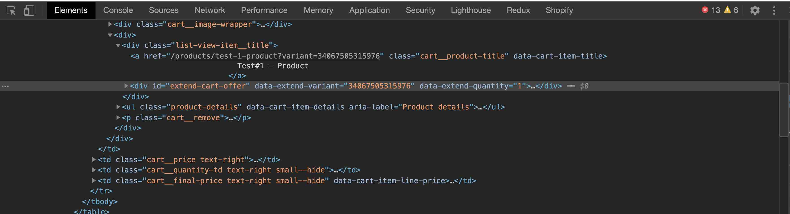

<h2>Create custom cart integration snippet</h2>

Inside your shopify theme code editor create a new snippet called **extend-cart-integration**. This is where you will call the Extend APIs to handle adding warranties to the cart.

**Themes** → **Snippets** → **Add a new snippet**

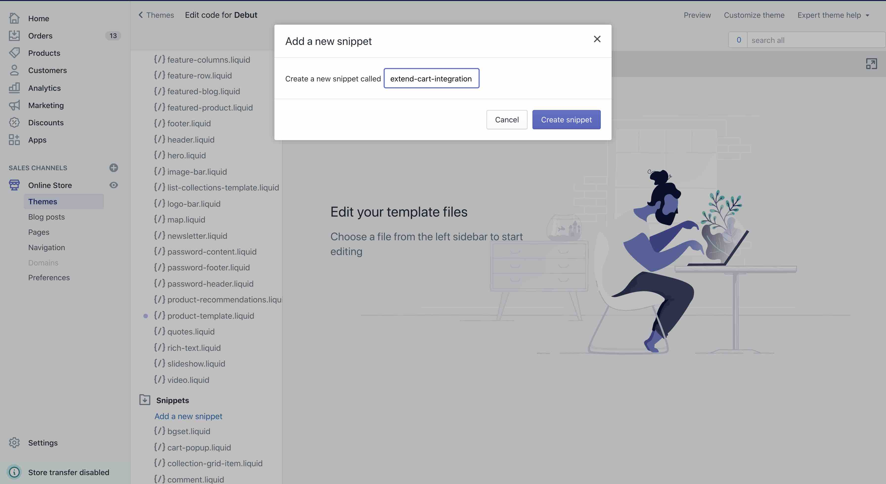

To ensure this snippet only runs when the Extend SDK is properly initialized, add the following code:

```html
<script>
  if (window.Extend && window.ExtendShopify) {
    // cart integration code goes here
  }
</script>
```

Add the helper `findAll` function to select all cart offer divs on cart page.

```javascript
var slice = Array.prototype.slice;

function findAll(element) {
  var items = document.querySelectorAll(element);
  return items ? slice.call(items, 0) : [];
}
```

Render the snippet in template where you added your Extend cart offer div.

<h2>Render cart offer buttons</h2>

Call the `findAll` helper method we added in the last step to find all the Extend cart offer divs. Here you need to pass in the Id of the Extend cart offer element (#extend-cart-offer).

As you iterate through each item pull out the `variantId` and the `quantity` from the **#extend-cart-offer** div data attributes.

```javascript
var variantId = el.getAttribute("data-extend-variant");
var quantity = el.getAttribute("data-extend-quantity");
```

Use the `warrantyAlreadyInCart()` function to determine if you should show the offer button. **@nima I updated this line**

```javascript
if (ExtendShopify.warrantyAlreadyInCart(variantId, cart.items)) {
  return;
}
```

Then render the cart offer buttons using the `Extend.buttons.renderSimpleOffer()` function.

```javascript
Extend.buttons.renderSimpleOffer(el, {
  referenceId: variantId,
  onAddToCart: function ({ plan, product }) {
    ExtendShopify.addPlanToCart(
      {
        plan: plan,
        product: product,
        quantity: quantity,
      },
      function (err) {
        // an error occurred
        if (err) {
          return;
        } else {
          // call your here function to reload cart page
        }
      }
    );
  },
});
```

The `ExtendShopify.addPlanToCart` also takes a callback where you can call add to cart function to add the product to the cart after the warranty has been added. Typically, reloading the window will suffice for the cart page.

```javascript
function(err) {
  // an error occurred
  if (err) {
    return
  } else {
    location.reload()
  }
```

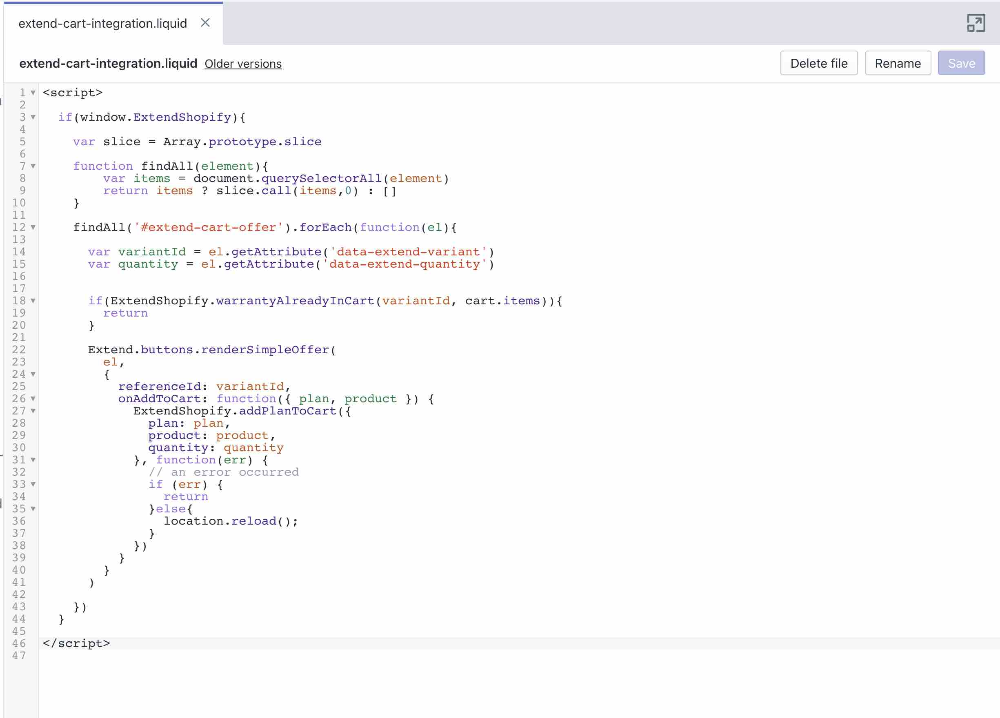

Verify the cart offer buttons are rendering correctly by previewing your theme and going to your cart page that has an active and enabled product in it. You should see the Extend cart offer button in the cart, and when you click it, it should launch the offer modal.


<h1>Extend Cart Normalization</h1>
<div class="key-line"></div>

As part of the checkout process, customers often update product quantities in their cart. The cart normalization feature will automatically adjust the quantity of Extend Protection Plans as the customer adjusts the quantity of the product they relate to. If a customer increases or decreases the quantity of products, the quantity for the related warranties in the cart should increase or decrease as well. In addition, if a customer has completely removed a product from the cart, any related warranties should be removed from the cart as well so the customer does not accidentally purchase a protection plan without a product.

To leverage cart normalization, you need to add the Extend normalize function to the cart integration script. First add the cart variable:

```liquid
var cart = {{ cart | json }}
```

Then add the **ExtendShopify.normalizeCart** function and pass the Shopify Cart object:

```javascript
ExtendShopify.normalizeCart({ cart: cart, balance: false }, function (
  err,
  data
) {
  if (data && data.updates) {
    location.reload();
  }
});
```

`ExtendShopify.normalizeCart()` will return a promise that will give you the `data` and `err` object to check if the cart needs to be normalized. If the `data` object exists and the `data.updates` is set to true, you will then call your function to refresh the cart page. Typically reloading the page will work for most Shopify cart pages.

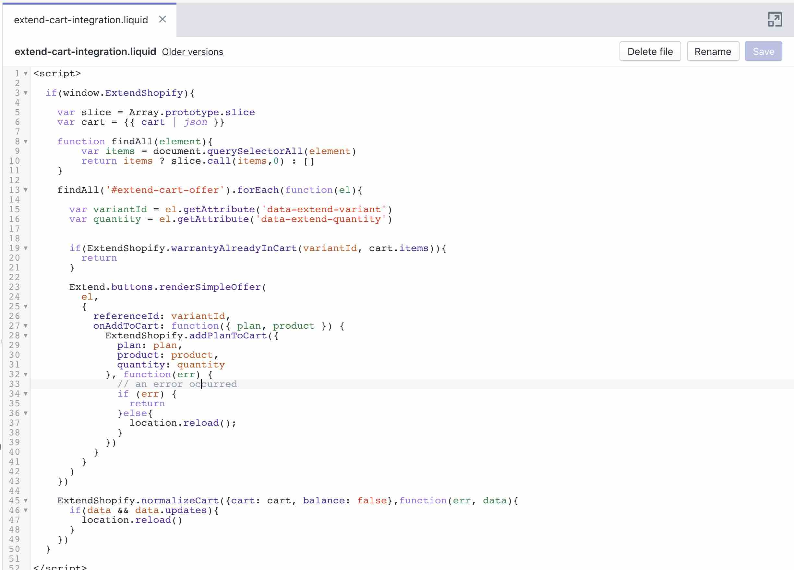

<h2>Balanced vs Unbalanced Carts</h2>

Now that you have the normlaice funtion in place, you need to decide if you want a **balanced** or **unbalanced** cart.

- Balanced cart: Whenever the quantity of a product with a warranty associated with it is increased, the quantity of the extended warranty sku associated with it will also increase to match.
- Unbalanced cart: Whenever the quantity of a product with a warranty associated with it is increased, the quantity of the extended warranty sku will remain the same, and it is up to the shopper to decide if he or she wants to add warranties to protect those products.

Balanced and unbalanced carts can be toggled with the `balance: true/false` property

<h2>Ajax Cart Normalization</h2>

If you are using an Ajax cart, the page does not reload whenever an item’s quantity is updated. This means that in order to normalize an Ajax cart, you need to identify when the quantity of an item changes and then run the `Extend.normalizeCart()` function. Typically, changing the quantity of the items in the cart will trigger a function that will make an API call to shopify to update the cart. You need to get this new updated Shopify cart object and pass it into the `Extend.normalizeCart()` function.

Wrap the cart integration code in a function. ex `initializeCartOffer()`. Then call the `initializeCartOffer()` function at the bottom of your script to run on page load.

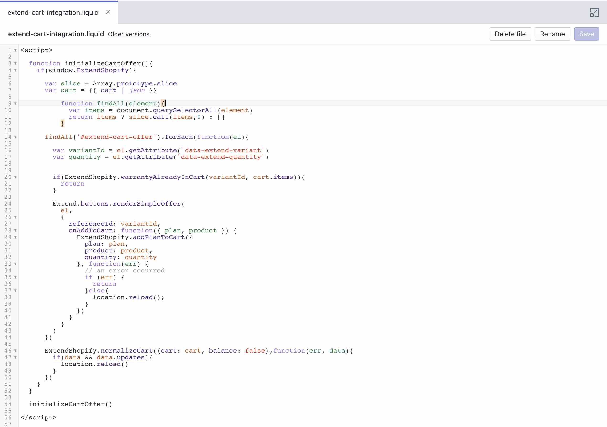

Now you need to dispatch an event whenever an item in the cart gets updated. To do this, first add an eventListener in your cart integration script.

Then, inside the eventListener you need to do the following:

- Make an API call to Shopify to get the most updated cart object
- Reassign the cart variable to the newCart object you get from the callback of the API call
- Call the function where you wrapped your Extend cart integration script in

```javascript
window.addEventListener("normalizeCart", function () {
  $.getJSON("/cart.js", function (newCart) {
    cart = newCart;
    initializeCartOffer();
  });
});
```

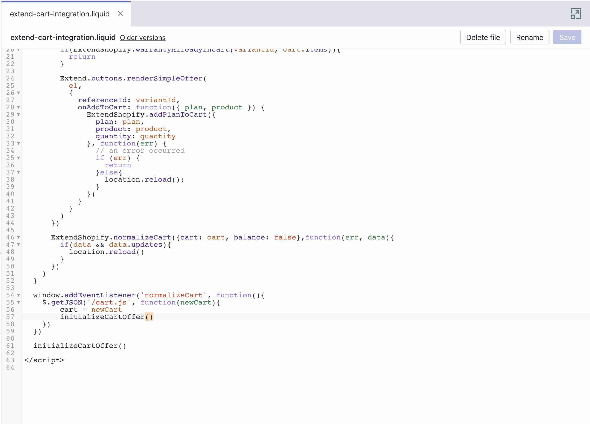

Now that you have the eventListener initialized, you need to find where in your code to dispatch a custom event. Find where in your Shopify theme the quantity of a cart item is updated and dispatch an event back to the cart integration script to pull in the new shopify cart object.

**Example:**
In the example below, the quantity of a cart item is being updated from the `updateCart()` function in the site.js file:

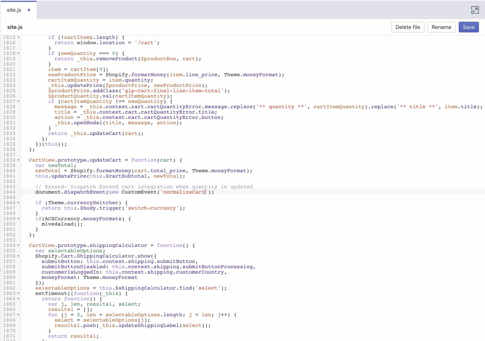

<h1>Ajax Side Cart Integration</h1>
<div class="key-line"></div>

Ajax side-carts are quite common, and the integration is similar to that of a regular Ajax cart.

<div style="display: flex; width:800px;" >
  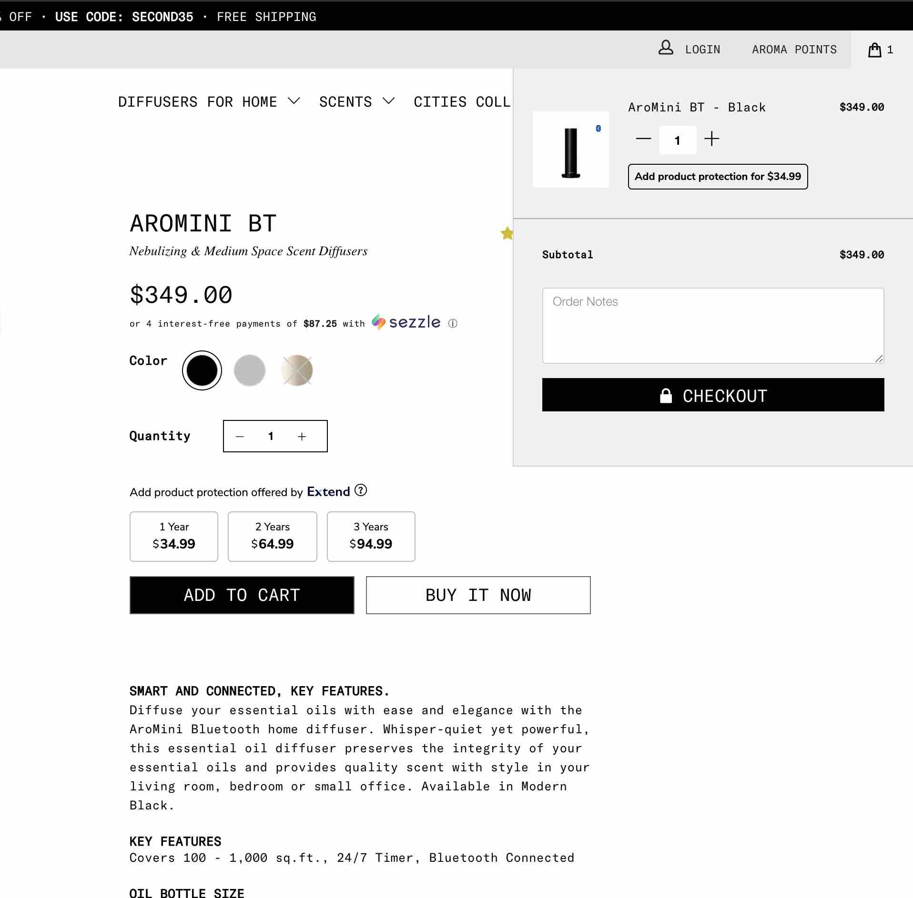
  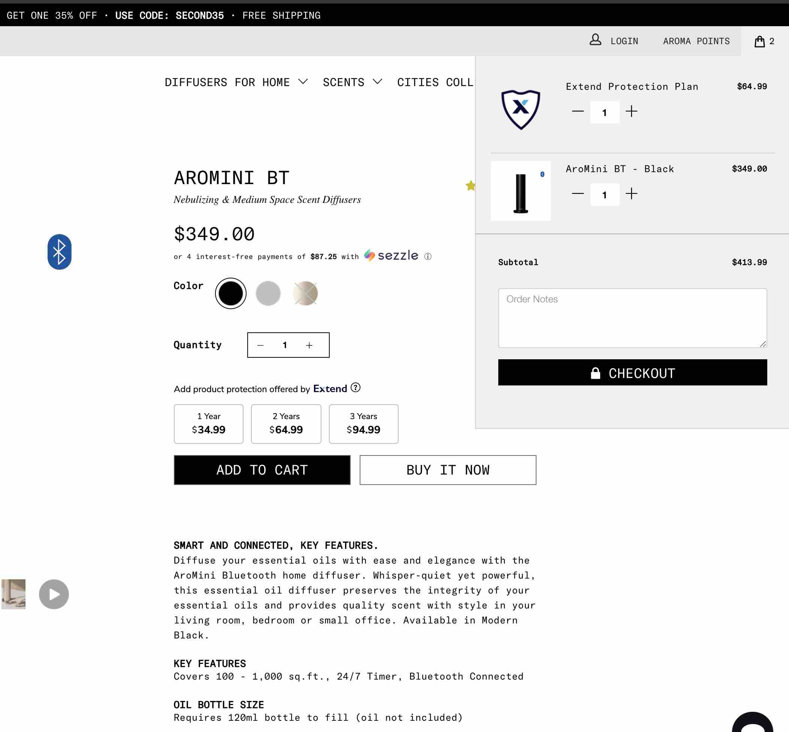
</div>

<h2>Add the Extend Cart Offer Element</h2>

Add an HTML element where you would like to place the Extend cart offer buttons. Typically because of the lack of space, we recommend placing it directly below each product in the cart. Typically this can be found in the **ajax-cart-template.liquid** file or in another similar template file.

<div id=“cart-extend-offer”></div>

You need to add this button under each product in the cart that doesn’t have a warranty. Find where the cart items are being iterated on in the template. Then set the `quantity` and `variantId` of the product to the cart offer div data attributes:

```html
<div
  id="extend-cart-offer"
  data-extend-variant="{{ variantId }}"
  data-extend-quantity="{{ itemQty }}"
></div>
```

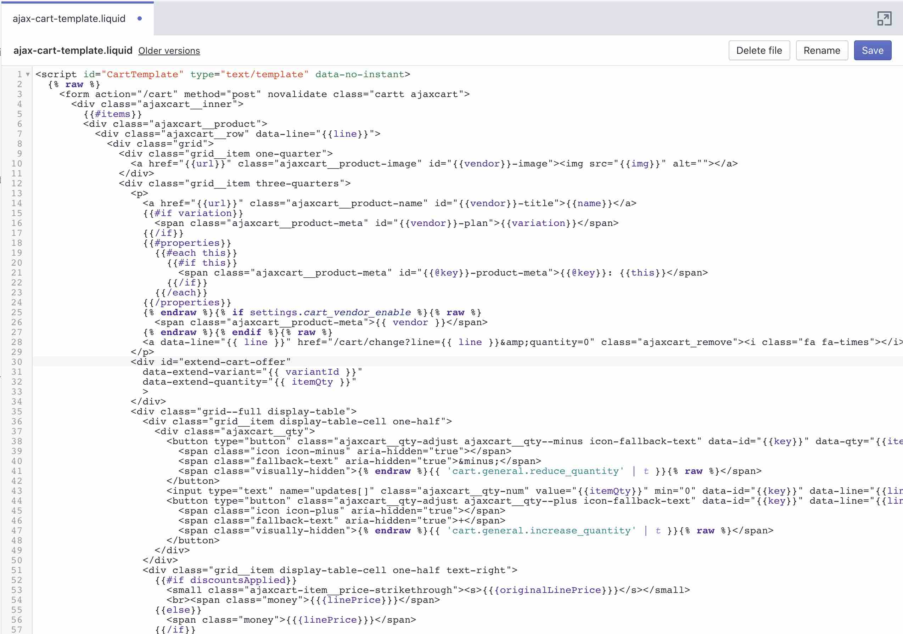

<h2>Create custom ajax side-cart integration snippet</h2>

Inside your shopify theme code editor create a new snippet called **extend-ajax-side-cart-integration**. This is where you will call the Extend Apis to handle displaying offers on the product page and adding the warranties to the cart.

**Themes** → **Snippets** → **Add a new snippet**

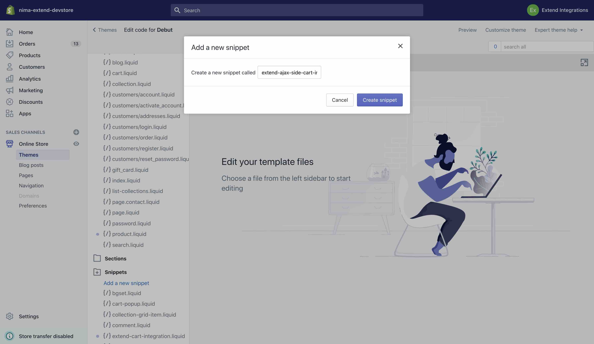

<h2>Render ajax side-cart offer buttons</h2>

Copy the code from the **extend-cart-integration** snippet that you created and paste it into the **extend-ajax-side-cart-integration** snippet. This will render the cart offer buttons to your products in your ajax side-cart.

Be sure to also add this event listener as we will use this to dispatch events from your themes js file to help rerun the script whenever a product is added or needs to be normalized.

```javascript
window.addEventListener("refreshSideCart", function () {
  $.getJSON("/cart.js", function (newCart) {
    cart = newCart;
    initializeCartOffer();
  });
});
```

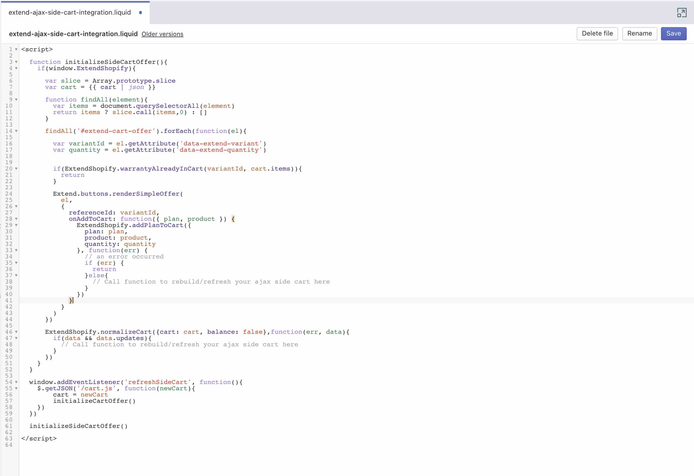

<h2>Adding warranty from ajax side cart</h2>

Whenever an Extended warranty is added from the ajax side cart, you need to rebuild your ajax side cart with the new shopify cart object as well as call the ajax-side-cart-integration script. This will add the warranty to the cart as well as remove the cart offer button from the product in your side-cart.

**Pro Tip**: You can add the eventListener to the ajax-side-cart-integration script and dispatch custom events from your theme’s javascript file. This will allow you to rerun the snippet whenever a products quantity is changed or if the product is removed.

```javascript
window.dispatchEvent(new CustomEvent("cartItemUpdated"));
```

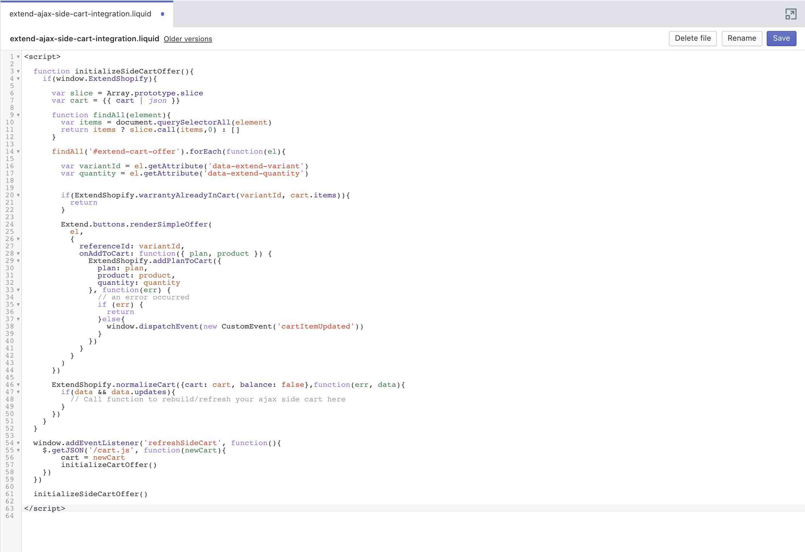

In the example below we add our eventListener to allow us to run the function that builds the ajax cart. This eventListener will be ran from the custom dispatched event we sent in the previous example.

```javascript
document.addEventListener("cartItemUpdated", function (e) {
  Extend.buttons.instance("#extend-cart-offer").destroy();

  $.getJSON("/cart.js", function (cart) {
    cartUpdateCallback(cart);
  });
});
```

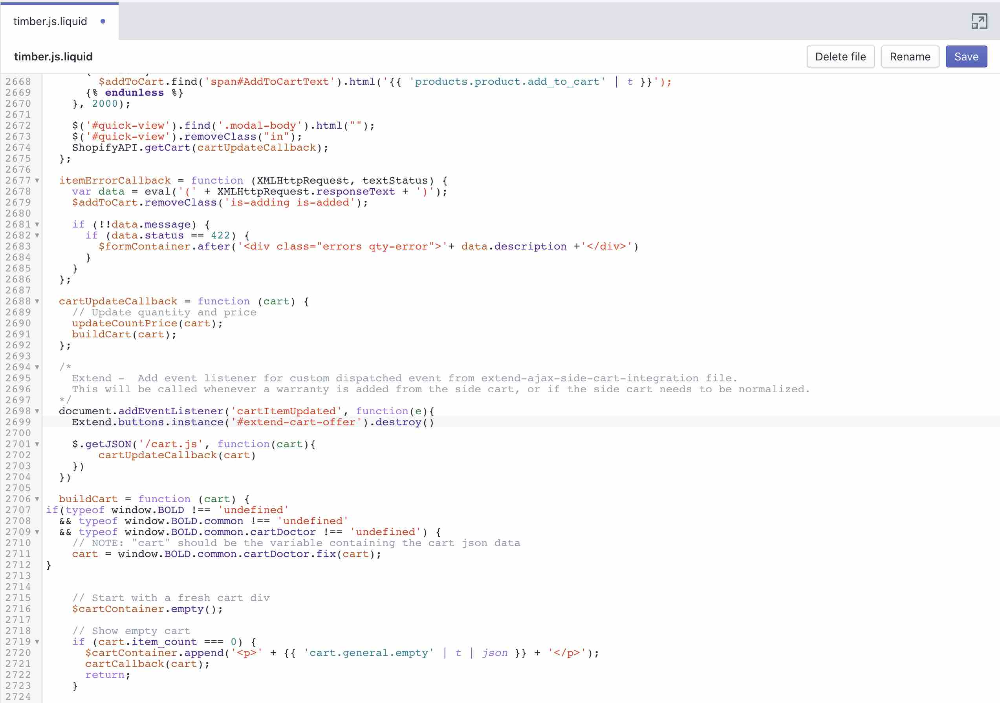

Once the ajax-side-cart is rebuilt, you may also need to dispatch an event back to the ajax side-cart-integration snippet to allow for the script to be run again.
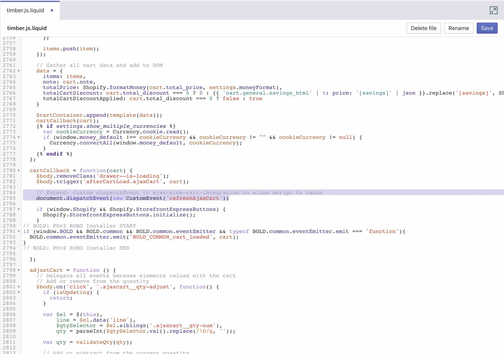

<h2>Ajax side-cart normalization</h2>

In order to normalize the ajax side-cart, find where in your theme the ajax side-cart is rebuilt/updated when the quantity of a product is changed and dispatch a custom event to the same eventListener that was setup in your ajax-cart-integration script

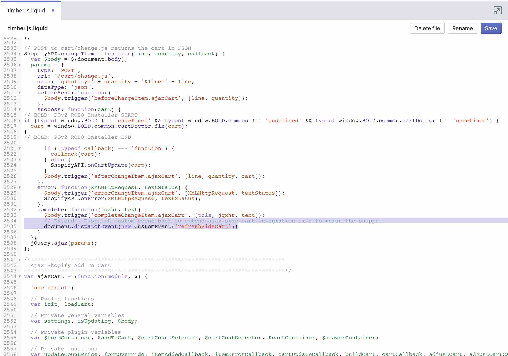

**Example**

Once our script is reran and we determine we need to normalize the cart, we will dispatch an event to the themes js file to allow for the ajax side cart to be rebuild/refreshed with the new Shopify cart object.
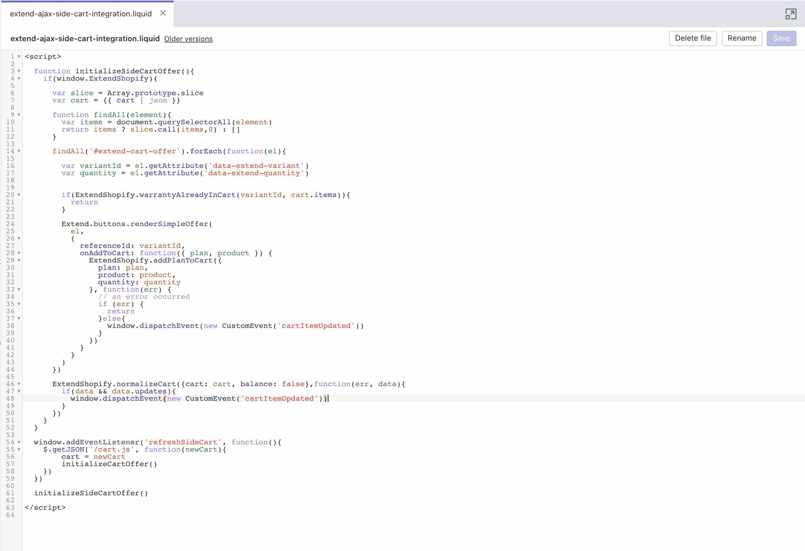

<h2>Final Review</h2>

After you have completed the above you should be ready to start selling extended warranties on your store. Before you publish your theme, please make sure to go through the integration checklist, which you can get from your merchant success manager if you have not already received it. **@nima we need to add a link here**
